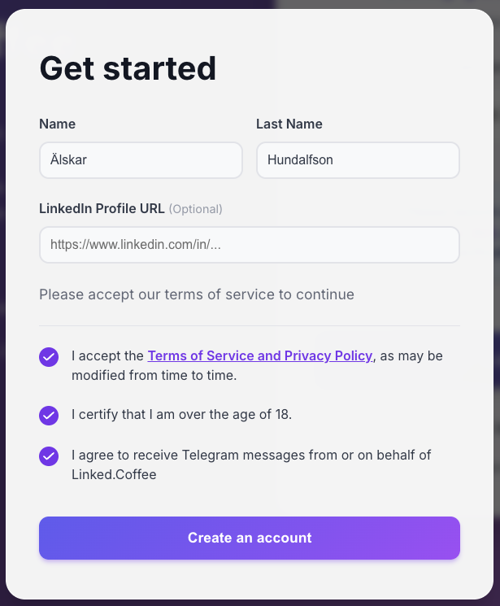

# Linked.Coffee — Closed Communities MVP

**Purpose:** Architecture and implementation plan for closed communities feature. MVP scope with future scalability in mind.

---

## 1. Core Concept

**Closed Communities** allow groups of people to have their own isolated Random Coffee pool. Members of a community only get matched with other members of the same community — they don't participate in the global Linked.Coffee pool.

### Use Cases

- **PRO Community** — Russian-speaking tech professionals learning together
- **Company teams** — Internal networking within organizations
- **Conference attendees** — Temporary community for event participants
- **Alumni networks** — University or bootcamp graduates

---

## 2. Key Design Decisions

| Decision         | Choice                  | Rationale                                      |
| ---------------- | ----------------------- | ---------------------------------------------- |
| User ↔ Community | Many-to-many            | User can be in PRO Community AND their company |
| Matching scope   | Per community, isolated | No cross-community matching                    |
| Admin model      | Any user can be admin   | Scalable, self-service                         |
| Join mechanism   | Invite code             | Simple, controllable                           |
| MVP admin        | Max (hardcoded)         | Simplify initial implementation                |

---

## 3. Database Architecture

### New Table: Communities - done

| Field          | Type          | Example                    | Description                 |
| -------------- | ------------- | -------------------------- | --------------------------- |
| `Community_ID` | Autonumber    | 1                          | Primary key                 |
| `Name`         | Text          | "PRO Community"            | Display name                |
| `Slug`         | Text          | "pro"                      | URL-friendly identifier     |
| `Invite_Code`  | Text          | "PRO2025"                  | Code for joining            |
| `Description`  | Long Text     | "Community for..."         | Shown on join page          |
| `Status`       | Single Select | Active / Paused / Archived | Controls visibility         |
| `Logo`         | Attachment    | —                          | Community branding (future) |
| `Created_At`   | Date          | 2025-01-15                 | Creation timestamp          |
| `Settings`     | Long Text     | `{"lang": "ru"}`           | JSON for future flexibility |

---

### New Table: Community_Members (Junction Table) - done

This enables many-to-many relationship between Members and Communities.

| Field        | Type                | Example                   | Description                |
| ------------ | ------------------- | ------------------------- | -------------------------- |
| `ID`         | Autonumber          | 1                         | Primary key                |
| `Member`     | Link to Members     | rec123                    | User reference             |
| `Community`  | Link to Communities | rec456                    | Community reference        |
| `Role`       | Single Select       | Member / Admin / Owner    | Permission level           |
| `Status`     | Single Select       | Active / Paused / Removed | Membership status          |
| `Joined_At`  | Date                | 2025-01-15                | When user joined           |
| `Invited_By` | Link to Members     | rec789                    | Referral tracking (future) |

---

### Changes to Existing Tables - done

#### Members Table

| Field               | Type                | Description                                                |
| ------------------- | ------------------- | ---------------------------------------------------------- |
| `Primary_Community` | Link to Communities | **NEW:** Default community for weekly opt-in               |
| `Is_Global_Pool`    | Checkbox            | **NEW:** TRUE = participates in global pool (default TRUE) |

> **Note:** `Primary_Community` determines which community the user opts into by default. If they're in multiple communities, they can switch (future feature).

#### Matches Table

| Field       | Type                | Description                                                    |
| ----------- | ------------------- | -------------------------------------------------------------- |
| `Community` | Link to Communities | **NEW:** Which community this match belongs to (NULL = global) |

---

## 4. User Flows

### Flow 1: Registration with Community Code

In this screen we add (below linkedin) a new input field for community code.
"Community code (if you have it)" field is optional.

**Backend logic:**

1. User enters code (e.g., "PRO2025")
2. API checks `Communities` table for matching `Invite_Code`
3. If found and `Status = Active`:
   - Create `Community_Members` record (Role: Member, Status: Active)
   - Set `Members.Primary_Community` to this community
   - Set `Members.Is_Global_Pool` to FALSE
4. If not found: show error, allow retry or skip
